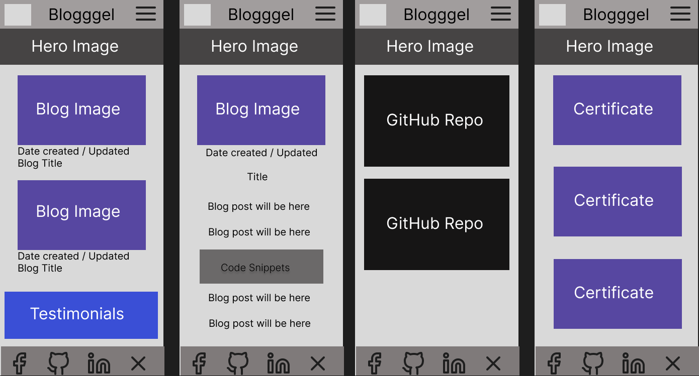
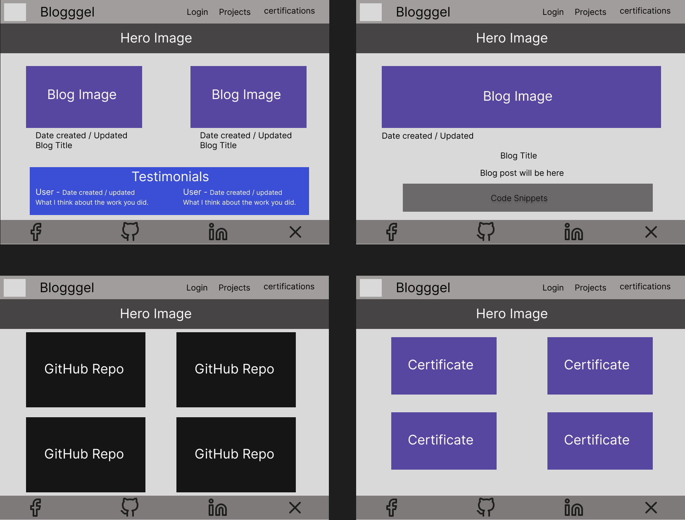
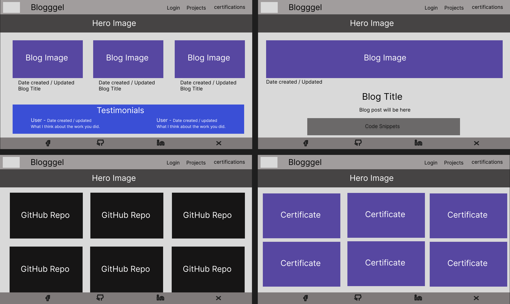
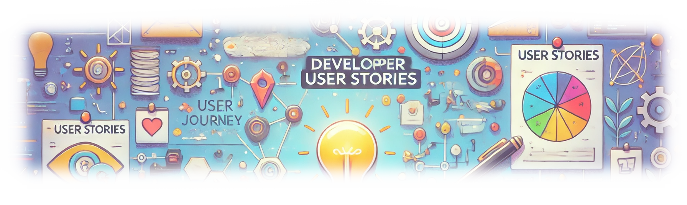
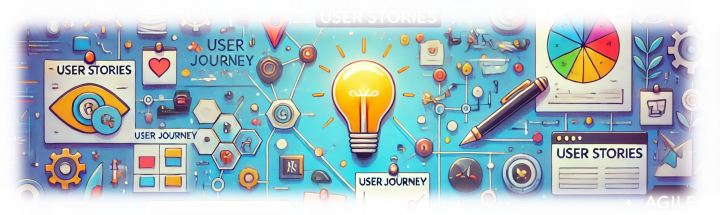
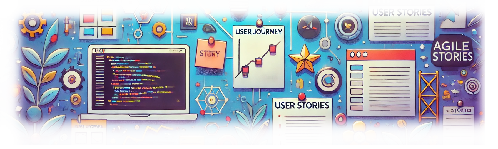

# Blogggel Portfolio and Developer Blog Website 

## Table of Contents

- [Introduction](#introduction)
- [Overview of the Project Purpose and Functionality](#overview-of-the-project-purpose-and-functionality)
- [User Experience (UX) Design](#user-experience-ux-design)
  - [Design Goals and Approaches](#design-goals-and-approaches)
  - [Typography and Fonts Used](#typography-and-fonts-used)
  - [Colour Palette](#colour-palette)
- [Wireframes](#wireframes)
  - [Mobile Wireframes](#mobile-wireframes)
  - [Tablet Wireframes](#tablet-wireframes)
  - [Desktop Wireframes](#desktop-wireframes)
- [User Stories](#user-stories)
  - [Visitor/User User Stories](#visitoruser-user-stories)
    - [User Story 1: User Registration](#user-story-1-user-registration)
    - [User Story 2: User Login](#user-story-2-user-login)
    - [User Story 3: Search Blogs by Programming Language](#user-story-3-search-blogs-by-programming-language)
    - [User Story 4: View Blog Posts](#user-story-4-view-blog-posts)
    - [User Story 5: Comment on Blog Posts](#user-story-5-comment-on-blog-posts)
    - [User Story 6: Edit Personal Profile](#user-story-6-edit-personal-profile)
    - [User Story 7: Like Blog Posts](#user-story-7-like-blog-posts)
    - [User Story 8: Bookmark Blog Posts](#user-story-8-bookmark-blog-posts)
    - [User Story 9: Receive Notifications](#user-story-9-receive-notifications)
    - [User Story 10: Responsive Design](#user-story-10-responsive-design)
  - [Admin User Stories](#admin-user-stories)
    - [Admin User Story 1: Create Blog Posts](#admin-user-story-1-create-blog-posts)
    - [Admin User Story 2: Read Blog Posts](#admin-user-story-2-read-blog-posts)
    - [Admin User Story 3: Update Blog Posts](#admin-user-story-3-update-blog-posts)
    - [Admin User Story 4: Delete Blog Posts](#admin-user-story-4-delete-blog-posts)
    - [Admin User Story 5: Moderate Comments](#admin-user-story-5-moderate-comments)
    - [Admin User Story 6: Manage Users](#admin-user-story-6-manage-users)
    - [Admin User Story 7: Review Reported Content](#admin-user-story-7-review-reported-content)
    - [Admin User Story 8: Manage Tags and Categories](#admin-user-story-8-manage-tags-and-categories)
    - [Admin User Story 9: View Site Analytics](#admin-user-story-9-view-site-analytics)
    - [Admin User Story 10: Configure Site Settings](#admin-user-story-10-configure-site-settings)
    - [Admin User Story 11: Add Article via API Endpoint](#admin-user-story-11-add-article-via-api-endpoint)
    - [Admin User Story 12: Update GitHub Repositories and Certificates](#admin-user-story-12-update-github-repositories-and-certificates)
    - [Admin User Story 13: Discord Bot Integration for Blog Posts](#admin-user-story-13-discord-bot-integration-for-blog-posts)
- [Features](#features)
  - [Home Page](#home-page)
  - [About Page](#about-page)
  - [Blog Page](#blog-page)
  - [Navigation Bar](#navigation-bar)
  - [Footer](#footer)
  - [Sign-Up Feature](#sign-up-feature)
  - [Sign-In Feature](#sign-in-feature)
  - [Sign-Out Feature](#sign-out-feature)
  - [Admin Features](#admin-features)
- [Entity Relationship Diagram](#entity-relationship-diagram)
  - [Data Structure and Relationships](#data-structure-and-relationships)
- [Testing](#testing)
  - [Manual Testing](#manual-testing)
  - [Responsive Testing](#responsive-testing)
  - [Validator Testing](#validator-testing)
  - [Lighthouse Testing](#lighthouse-testing)
- [Deployment](#deployment)
  - [Connecting to GitHub](#connecting-to-github)
  - [Django Project Setup](#django-project-setup)
    - [Install Django](#install-django)
    - [Creating An App](#creating-an-app)
    - [Prerequisites Before Deploying to Heroku](#prerequisites-before-deploying-to-heroku)
  - [Database Setup (PostgreSQL)](#database-setup-postgresql)
  - [Cloudinary](#cloudinary)
  - [Deploying to Heroku](#deploying-to-heroku)
  - [Clone the Project](#clone-the-project)
  - [Fork the Project](#fork-the-project)
- [Technologies & Languages Used](#Technologies-&-Languages-Used)
- [Usage](#usage)
- [Technologies Used](#technologies-used)
- [Features](#features-1)
- [License](#license)
- [Contact](#contact)
- [Acknowledgements](#acknowledgements)
- [Credits](#credits)
  - [Project Inspiration and Sources](#project-inspiration-and-sources)
  - [Content Creation Credits](#content-creation-credits)
  - [Media Credits](#media-credits)
- [No Contribution](#no-contribution)


# Introduction
After spending a long time as a homemaker raising my children, I’ve decided to turn my long-time passion for programming into a career. This project represents a significant step in that journey—a way to combine the skills I’ve honed as a self-taught programmer with my dedication to lifelong learning.

Creating a full-stack development blog that integrates my GitHub repositories and a collection of certifications is more than just a technical challenge; it’s a personal statement. It’s a way to showcase my growth as a developer while reflecting my unique perspective and experiences. This project allows me to bring together modern backend development with Django, API integrations, and a dynamic, user-friendly frontend to build something practical and meaningful.

Choosing this as my capstone project felt natural because it’s not just a portfolio—it’s a bridge between the years I’ve spent nlearning from others and the career I’m building for myself. It demonstrates my ability to manage complex tasks, learn new technologies, and create something that celebrates both where I’ve been and where I’m headed.

- [Visit Site]()
- [Find me on LinkedIN](https://www.linkedin.com/feed/)

## User Experience (UX) Design


### Design Goals and Approaches

- Provide an intuitive and easy-to-navigate user interface.
- Maintain a professional, developer-focused aesthetic to appeal to potential employers and collaborators.

### Typography and Fonts Used


### Colour Palette

- The colour palette consists of:


[Back to Table of Contents](#table-of-contents)

## Wireframes


Wireframes were created to guide the layout of each key page of the website:


### Mobile Wireframes

- These are my mobile wireframes showing the individual website pages. (The Colours indicate different sections, not the final colours.)




### Tablet Wireframes
- These are my tablet wireframes showing the individual website pages. (The Colours indicate different sections, not the final colours.)



### Desktop Wireframes
- These are my Desktop wireframes showing the individual website pages. (The Colours indicate different sections, not the final colours.)



[Back to Table of Contents](#table-of-contents)

# User Stories


## User Stories - Table of Contents

- [Visitor/User User Stories](#visitoruser-user-stories)
  - [User Story 1: User Registration](#user-story-1-user-registration)
  - [User Story 2: User Login](#user-story-2-user-login)
  - [User Story 3: Search Blogs by Programming Language](#user-story-3-search-blogs-by-programming-language)
  - [User Story 4: View Blog Posts](#user-story-4-view-blog-posts)
  - [User Story 5: Comment on Blog Posts](#user-story-5-comment-on-blog-posts)
  - [User Story 6: Edit Personal Profile](#user-story-6-edit-personal-profile)
  - [User Story 7: Like Blog Posts](#user-story-7-like-blog-posts)
  - [User Story 8: Bookmark Blog Posts](#user-story-8-bookmark-blog-posts)
  - [User Story 9: Receive Notifications](#user-story-9-receive-notifications)
  - [User Story 10: Responsive Design](#user-story-10-responsive-design)
- [Admin User Stories](#admin-user-stories)
  - [Admin User Story 1: Create Blog Posts](#admin-user-story-1-create-blog-posts)
  - [Admin User Story 2: Read Blog Posts](#admin-user-story-2-read-blog-posts)
  - [Admin User Story 3: Update Blog Posts](#admin-user-story-3-update-blog-posts)
  - [Admin User Story 4: Delete Blog Posts](#admin-user-story-4-delete-blog-posts)
  - [Admin User Story 5: Moderate Comments](#admin-user-story-5-moderate-comments)
  - [Admin User Story 6: Manage Users](#admin-user-story-6-manage-users)
  - [Admin User Story 7: Review Reported Content](#admin-user-story-7-review-reported-content)
  - [Admin User Story 8: Manage Tags and Categories](#admin-user-story-8-manage-tags-and-categories)
  - [Admin User Story 9: View Site Analytics](#admin-user-story-9-view-site-analytics)
  - [Admin User Story 10: Configure Site Settings](#admin-user-story-10-configure-site-settings)

  [Back to Table of Contents](#table-of-contents)

---

## Visitor/User User Stories



### User Story 1: User Registration

**User Story:**

> **As a** visitor,  
> **I can** sign up for an account,  
> **so that** I can access member-only features like commenting and personalizing my experience.

**Acceptance Criteria:**

- Users can register with a valid email address and password.
- Users receive a confirmation email with an activation link.
- The system prevents registration with an already registered email.
- Passwords meet minimum security requirements (e.g., length, complexity).

**Tasks Involved:**

1. **Design Registration Page**  
   Create a responsive registration form with fields for email and password. Implement client-side validation for email format and password strength using JavaScript.

2. **Implement Backend Registration Logic**  
   Set up Django models for user accounts with secure password hashing. Handle server-side validation and error messaging. Ensure prevention of duplicate accounts.

3. **Email Confirmation**  
   Configure Django's email backend to send confirmation emails. Generate unique activation tokens. Create views to handle account activation via the confirmation link.

4. **Security Measures**  
   Implement protection against bots and spam registrations (e.g., CAPTCHA). Ensure compliance with data protection regulations.

---

### User Story 2: User Login

**User Story:**

> **As a** registered user,  
> **I can** log into my account,  
> **so that** I can access member-only features and personalize my experience.

**Acceptance Criteria:**

- Users can log in using their registered email and password.
- Users receive an error message if credentials are invalid.
- Users can opt to stay logged in with a "Remember Me" option.
- Users can reset their password if forgotten.

**Tasks Involved:**

1. **Design Login Page**  
   Create a responsive login form with fields for email and password. Include a "Remember Me" checkbox and "Forgot Password" link.

2. **Implement Authentication Logic**  
   Utilize Django's built-in authentication system. Manage user sessions securely. Implement persistent login if "Remember Me" is selected.

3. **Error Handling**  
   Display clear error messages for incorrect credentials. Prevent account enumeration by using generic error messages.

4. **Password Reset Functionality**  
   Allow users to request a password reset link via email. Implement secure password reset workflows.

5. **Security Measures**  
   Protect against brute-force attacks (e.g., rate limiting, account lockout after multiple failures). Ensure secure session management (e.g., use of HTTPS, secure cookies).

---

### User Story 3: Search Blogs by Programming Language

**User Story:**

> **As a** user,  
> **I can** search for blog posts containing specific programming languages or keywords,  
> **so that** I can easily find content relevant to my interests.

**Acceptance Criteria:**

- Users can enter programming languages or keywords into a search bar.
- Search results display blog posts that match the query.
- Users can filter results by date, popularity, or category.
- The system handles misspellings and suggests corrections.

**Tasks Involved:**

1. **Design Search Interface**  
   Add a prominently placed search bar accessible from all pages. Include advanced search options for filters.

2. **Implement Search Functionality**  
   Use Django's ORM to query the database for matching posts. Implement full-text search capabilities. Handle case-insensitive searches and partial matches.

3. **Display Search Results**  
   Create a results page that lists matching blog posts with snippets. Implement pagination for long lists of results.

4. **Optimize Search Performance**  
   Index relevant database fields to speed up queries. Implement caching strategies for frequent searches.

5. **Error Handling**  
   Provide user feedback when no results are found. Suggest similar search terms or popular posts.

---

### User Story 4: View Blog Posts

**User Story:**

> **As a** user,  
> **I can** view a list of blog posts and read individual articles,  
> **so that** I can consume the content provided on the website.

**Acceptance Criteria:**

- Users can see a list of recent or popular blog posts.
- Blog post listings include titles, excerpts, authors, and publication dates.
- Clicking on a blog title navigates to the full article.
- The blog post page displays the content, author information, tags, and comments.

**Tasks Involved:**

1. **Design Blog Listing Page**  
   Create a layout that showcases blog posts attractively. Implement sorting options (e.g., newest first, most popular).

2. **Implement Backend Logic**  
   Fetch blog post data from the database. Handle pagination for blog listings.

3. **Design Blog Detail Page**  
   Display the full content of the blog post. Include metadata like author name, publication date, and tags. Provide navigation to previous and next posts.

4. **Enhance User Engagement**  
   Add social sharing buttons. Show related posts based on tags or categories.

---

### User Story 5: Comment on Blog Posts

**User Story:**

> **As a** logged-in user,  
> **I can** add comments to blog posts,  
> **so that** I can share suggestions and engage with the community.

**Acceptance Criteria:**

- Users can submit comments on any blog post.
- Comments are displayed below the blog post in chronological order.
- Users can edit or delete their own comments within a certain time frame.
- The system prevents spam and inappropriate content.

**Tasks Involved:**

1. **Design Comment Section**  
   Create an input area for submitting comments. Display existing comments with timestamps and user names.

2. **Implement Comment Functionality**  
   Set up models for comments linked to users and blog posts. Handle comment submission and storage in the database.

3. **Enable Comment Editing and Deletion**  
   Allow users to edit or delete their own comments. Implement time restrictions if necessary.

4. **Implement Moderation Tools**  
   Use profanity filters and spam detection mechanisms. Allow users to report inappropriate comments.

5. **Notification System**  
   Notify users when someone replies to their comment.

6. **Security Measures**  
   Protect against XSS by sanitizing user inputs. Implement rate limiting to prevent spam.

---

### User Story 6: Edit Personal Profile

**User Story:**

> **As a** logged-in user,  
> **I can** edit my profile information,  
> **so that** I can personalize my account.

**Acceptance Criteria:**

- Users can update their display name, bio, and profile picture.
- Changes are saved and immediately reflected on their profile page.
- Users can change their password securely.
- The system validates inputs and provides feedback.

**Tasks Involved:**

1. **Design Profile Page**  
   Create a user profile page displaying personal information. Include an "Edit Profile" button.

2. **Implement Profile Editing Functionality**  
   Develop forms for updating profile details. Handle file uploads for profile pictures.

3. **Implement Password Change Feature**  
   Provide a secure way for users to change their passwords. Require current password for verification.

4. **Validation and Error Handling**  
   Validate inputs (e.g., acceptable image formats, bio length). Display error messages for invalid data.

5. **Security Measures**  
   Ensure proper authentication before allowing profile edits. Protect against unauthorized access.

---

### User Story 7: Like Blog Posts

**User Story:**

> **As a** user,  
> **I can** like blog posts,  
> **so that** I can show appreciation for content I find valuable.

**Acceptance Criteria:**

- Users can click a "Like" button on any blog post.
- The total number of likes is displayed and updates in real-time.
- Users cannot like the same post more than once.
- Users can unlike a post they previously liked.

**Tasks Involved:**

1. **Design Like Button**  
   Add a "Like" button to blog posts with a like count. Change the button state when liked or unliked.

2. **Implement Like Functionality**  
   Create a model to track likes associated with users and posts. Update the like count without reloading the page (AJAX).

3. **Prevent Multiple Likes**  
   Check if the user has already liked the post before allowing a new like. Provide an option to unlike.

4. **Optimize Performance**  
   Cache like counts for efficient retrieval. Handle concurrent likes appropriately.

---

### User Story 8: Bookmark Blog Posts

**User Story:**

> **As a** logged-in user,  
> **I can** bookmark blog posts,  
> **so that** I can save them for easy access later.

**Acceptance Criteria:**

- Users can add or remove blog posts from their bookmarks.
- Users can view a list of their bookmarked posts.
- Bookmarked posts are accessible from the user's profile.

**Tasks Involved:**

1. **Design Bookmark Feature**  
   Add a "Bookmark" button on blog posts. Create a bookmarks section in the user's profile.

2. **Implement Bookmark Functionality**  
   Create a model to store bookmarks linked to users and posts. Handle adding and removing bookmarks.

3. **Display Bookmarked Posts**  
   Show a list of bookmarks with links to the full posts. Allow sorting or categorizing bookmarks.

4. **Optimize User Experience**  
   Update bookmark status without page reload. Provide visual feedback when a post is bookmarked.

---

### User Story 9: Receive Notifications

**User Story:**

> **As a** logged-in user,  
> **I can** receive notifications for interactions like replies to my comments,  
> **so that** I stay informed about engagements.

**Acceptance Criteria:**

- Users receive in-app notifications for replies, mentions, and likes.
- Notifications are displayed in a notification center.
- Users can adjust their notification preferences.

**Tasks Involved:**

1. **Design Notification Center**  
   Add a notification icon accessible from all pages. Display a dropdown or page listing notifications.

2. **Implement Notification System**  
   Create models for notifications linked to users. Trigger notifications on relevant events (e.g., comment replies).

3. **Manage Notification Preferences**  
   Allow users to enable or disable specific types of notifications. Update user settings accordingly.

4. **Real-Time Updates**  
   Use WebSockets or long polling to deliver notifications in real-time.

5. **Marking Notifications as Read**  
   Provide functionality for users to mark notifications as read. Visually distinguish between read and unread notifications.

---

### User Story 10: Responsive Design

**User Story:**

> **As a** user,  
> **I can** access the website on various devices (desktop, tablet, mobile),  
> **so that** I have a seamless browsing experience.

**Acceptance Criteria:**

- The website layout adjusts appropriately on different screen sizes.
- All functionalities are accessible and user-friendly on mobile devices.
- Touch interactions are optimized for mobile devices.
- Images and media scale correctly without loss of quality.

**Tasks Involved:**

1. **Implement Responsive Layouts**  
   Use CSS media queries to adjust styles based on screen size. Design fluid grids and flexible images.

2. **Optimize Navigation for Mobile**  
   Implement a responsive menu (e.g., hamburger menu). Ensure buttons and links are appropriately sized for touch.

3. **Test Across Devices**  
   Perform testing on various devices and browsers. Use tools like Chrome DevTools and physical devices for testing.

4. **Performance Optimization**  
   Minimize load times on mobile networks. Implement lazy loading of images and assets.

5. **Enhance Accessibility**  
   Ensure text is readable without zooming. Maintain sufficient color contrast.

[User Story - Table of Contents](#User-Stories---Table-of-Contents)
[Back to Table of Contents](#table-of-contents)

---


## Admin User Stories



### Admin User Story 1: Create Blog Posts

**User Story:**

> **As an** admin,  
> **I can** create new blog posts,  
> **so that** I can publish fresh content on the website.

**Acceptance Criteria:**

- Admins can access a form to create new blog posts.
- The form allows input of title, content, tags, categories, and images.
- Posts can be saved as drafts or published immediately.
- The system validates inputs and provides error messages for invalid data.

**Tasks Involved:**

1. **Design Create Post Form**  
   Develop a rich text editor for content creation. Include fields for title, tags, categories, and image uploads.

2. **Implement Backend Logic**  
   Set up models for blog posts with appropriate fields. Handle file uploads securely and efficiently.

3. **Draft and Publish Options**  
   Allow saving posts as drafts. Provide options to schedule future publication dates.

4. **Validation and Error Handling**  
   Ensure required fields are filled. Validate content length and image formats.

5. **Security Measures**  
   Restrict access to admin users. Implement CSRF protection.

---

### Admin User Story 2: Read Blog Posts

**User Story:**

> **As an** admin,  
> **I can** view all existing blog posts,  
> **so that** I can manage and review content on the website.

**Acceptance Criteria:**

- Admins can see a list of all blog posts with details like title, author, status, and publication date.
- The list supports searching, sorting, and filtering (e.g., by status or author).
- Admins can view individual blog posts in detail.

**Tasks Involved:**

1. **Design Admin Posts List**  
   Create an interface displaying blog posts in a tabular format. Include options for sorting and filtering.

2. **Implement Backend Logic**  
   Fetch blog post data with necessary details. Handle pagination for large numbers of posts.

3. **View Post Details**  
   Provide a way to view the full content of each post from the admin panel.

4. **Enhance Usability**  
   Include indicators for unpublished or scheduled posts. Highlight posts that require attention (e.g., those with reported comments).

5. **Security Measures**  
   Ensure only admins can access the admin posts list. Protect against unauthorized data exposure.

---

### Admin User Story 3: Update Blog Posts

**User Story:**

> **As an** admin,  
> **I can** edit existing blog posts,  
> **so that** I can update or correct content as needed.

**Acceptance Criteria:**(## User Stories - Table of Contents)

- Admins can access an edit form for any blog post.
- Changes are saved and reflected on the website immediately or scheduled as per admin's choice.
- The system tracks changes for auditing purposes.
- Validation ensures that all required fields are properly updated.

**Tasks Involved:**

1. **Design Edit Post Form**  
   Use the same form as the create post form, pre-filled with existing data. Include options to change the publication status.

2. **Implement Update Functionality**  
   Allow updates to the blog post in the database. Handle file replacements for images if necessary.

3. **Version Control (Optional)**  
   Implement a version history to track changes over time.

4. **Validation and Error Handling**  
   Validate inputs before saving changes. Provide error messages for invalid data.

5. **Security Measures**  
   Restrict edit permissions to admins. Protect against concurrent edit conflicts.

---

### Admin User Story 4: Delete Blog Posts

**User Story:**

> **As an** admin,  
> **I can** delete blog posts,  
> **so that** I can remove outdated or inappropriate content from the website.

**Acceptance Criteria:**

- Admins can delete any blog post from the admin interface.
- The system prompts for confirmation before deletion.
- Deleted posts are removed from the website immediately.
- Optionally, posts are soft-deleted (archived) rather than permanently removed.

**Tasks Involved:**

1. **Implement Delete Functionality**  
   Add delete actions in the admin posts list. Implement soft-delete by marking posts as inactive, if desired.

2. **Confirmation Prompts**  
   Require admins to confirm deletion to prevent accidental loss.

3. **Handle Dependencies**  
   Decide how to handle comments and likes associated with deleted posts.

4. **Audit Logging**  
   Record deletion actions with timestamps and admin details.

5. **Security Measures**  
   Ensure only authorized admins can delete posts. Protect against mass deletion exploits.

---

### Admin User Story 5: Moderate Comments

**User Story:**

> **As an** admin,  
> **I can** view, edit, or delete user comments,  
> **so that** I can maintain the quality of discussions.

**Acceptance Criteria:**

- Admins can see a list of all comments with associated user and post information.
- Admins can edit or delete comments as needed.
- The system logs moderation actions for accountability.
- Users are notified if their comment is edited or deleted.

**Tasks Involved:**

1. **Design Comment Moderation Interface**  
   Create a dashboard displaying comments with filters for reported or recent comments.

2. **Implement Edit and Delete Functionality**  
   Allow admins to edit comment content. Provide delete options with confirmation prompts.

3. **Notification System**  
   Notify users when their comment is edited or removed. Provide reasons for moderation actions.

4. **Audit Logging**  
   Record all moderation actions with details.

5. **Security Measures**  
   Restrict moderation capabilities to admins. Ensure changes are reflected appropriately on the frontend.

---

### Admin User Story 6: Manage Users

**User Story:**

> **As an** admin,  
> **I can** view and manage user accounts,  
> **so that** I can handle issues related to user behavior.

**Acceptance Criteria:**

- Admins can search for and view user profiles.
- Admins can deactivate or ban users violating policies.
- Admins can reset user passwords if necessary.
- The system maintains records of actions taken on user accounts.

**Tasks Involved:**

1. **Design User Management Interface**  
   Create an admin page listing users with search and filter options.

2. **Implement Account Controls**  
   Provide options to deactivate, ban, or reactivate user accounts. Allow password resets with secure procedures.

3. **User Activity Monitoring**  
   Display recent activities of users (e.g., comments, posts liked).

4. **Audit Logging**  
   Record all admin actions taken on user accounts.

5. **Security Measures**  
   Ensure only authorized admins have access to user management. Protect sensitive user data.

---

### Admin User Story 7: Review Reported Content

**User Story:**

> **As an** admin,  
> **I can** review content that users have reported,  
> **so that** I can address any violations promptly.

**Acceptance Criteria:**

- Admins receive notifications of reported content.
- Reported content is listed in a dedicated review queue.
- Admins can take actions such as editing, deleting, or ignoring reports.
- Users are informed about the resolution of their reports.

**Tasks Involved:**

1. **Implement Reporting Mechanism**  
   Enable users to report posts and comments. Collect reports with details and optional user comments.

2. **Design Review Queue Interface**  
   Create an admin page listing reported content with relevant information.

3. **Implement Action Options**  
   Provide actions like "Delete Content," "Warn User," or "Mark as Safe."

4. **Notification System**  
   Notify reporting users about the outcome. Optionally, notify content creators if their content is moderated.

5. **Audit Logging**  
   Record actions taken on reported content.

6. **Security Measures**  
   Ensure confidentiality of reports. Protect against false reporting.

---

### Admin User Story 8: Manage Tags and Categories

**User Story:**

> **As an** admin,  
> **I can** add, edit, or delete tags and categories,  
> **so that** I can organize blog content effectively.

**Acceptance Criteria:**

- Admins can create new tags and categories.
- Admins can rename or delete existing tags and categories.
- Changes are reflected across all associated blog posts.
- The system prevents deletion of tags or categories in use without confirmation.

**Tasks Involved:**

1. **Design Tag and Category Management Interface**  
   Create admin pages for managing tags and categories.

2. **Implement CRUD Operations**  
   Allow creation, editing, and deletion of tags and categories.

3. **Handle Dependencies**  
   Update or remove associations with blog posts when tags/categories are modified.

4. **Validation and Error Handling**  
   Prevent duplicate tags or categories. Confirm before deleting tags/categories in use.

5. **Security Measures**  
   Restrict access to authorized admins. Protect against injection attacks.

---

### Admin User Story 9: View Site Analytics

**User Story:**

> **As an** admin,  
> **I can** access analytics on site performance,  
> **so that** I can make informed decisions to improve the website.

**Acceptance Criteria:**

- Admins can view metrics like page views, user sign-ups, and popular posts.
- Data can be filtered by date range and content type.
- Analytics are presented in an understandable format (e.g., charts, graphs).

**Tasks Involved:**

1. **Integrate Analytics Tools**  
   Use services like Google Analytics or build custom analytics.

2. **Design Analytics Dashboard**  
   Create visual representations of key metrics.

3. **Implement Data Collection**  
   Track necessary data points without violating user privacy.

4. **Optimize Performance**  
   Ensure analytics gathering does not slow down the website.

5. **Security and Compliance**  
   Comply with data protection regulations. Provide options for users to opt-out of tracking.

---

### Admin User Story 10: Configure Site Settings

**User Story:**

> **As an** admin,  
> **I can** update website settings and appearance,  
> **so that** I can keep the site up-to-date and visually appealing.

**Acceptance Criteria:**

- Admins can change themes, layouts, and color schemes.
- Updates to settings are applied site-wide immediately.
- The system prevents invalid configurations.

**Tasks Involved:**

1. **Design Settings Interface**  
   Create a user-friendly interface for site configuration.

2. **Implement Theme and Layout Options**  
   Develop or integrate multiple themes. Allow customization of colors, fonts, and layouts.

3. **Apply Changes Site-Wide**  
   Ensure updates are reflected across all pages.

4. **Validation and Error Handling**  
   Prevent configurations that could break the site.

5. **Security Measures**  
   Restrict access to site settings to authorized admins. Backup current settings before applying changes.

[User Story - Table of Contents](#User-Stories---Table-of-Contents)

[Back to Table of Contents](#table-of-contents)


## Summary

By separating each operation into individual user stories and including the **User Story**, **Acceptance Criteria**, and **Tasks Involved**, we've created a clear and detailed roadmap for the development of your developer blog website. Each user story focuses on a specific functionality, making it easier to plan, implement, and test.

These user stories can be added to your GitHub project board as individual tasks or issues. This approach aligns with agile development practices, allowing your team to focus on delivering value incrementally and ensuring that all acceptance criteria are met through well-defined tasks.

---

**Next Steps:**

1. **Add User Stories to Project Board:**
   - Create issues for each user story.
   - Include acceptance criteria and tasks in the issue description.

2. **Assign Tasks to Team Members:**
   - Distribute tasks based on expertise and workload.

3. **Set Milestones and Sprints:**
   - Organize user stories into sprints for iterative development.

4. **Implement Testing Strategies:**
   - Develop test cases based on acceptance criteria.
   - Use automated testing where possible.

5. **Monitor Progress and Metrics:**
   - Track completion of tasks.
   - Review test results to ensure quality.

By following this structured approach, you'll be able to efficiently develop your website with clear objectives and measurable outcomes. If you need assistance with any specific tasks or have further questions, feel free to ask!

[User Story - Table of Contents](#User-Stories---Table-of-Contents)

[Back to Table of Contents](#table-of-contents)

## Features

### Home Page
- Displays a list of recent blog posts and highlights of portfolio projects.

### GitHub Page
- Provides insight into my background, interests, and motivations.

### Certifications Page
- Provides insight into my background, interests, and motivations.

### Blog Page
- Users can view all blog posts, search by programming languages, and see featured articles.

### Navigation Bar
- Available throughout the site with links to Home, Blog, About, and Contact pages.

### Footer
- Contains links to social media, quick navigation, and contact information.

### Sign-Up Feature
- Visitors can create an account to engage with content and personalize their experience.

### Sign-In Feature
- Registered users can log in to access member-only content and features.

### Sign-Out Feature
- Users can sign out, with their session safely terminated.

### Admin Features
- Admins can create, edit, delete posts, manage users, and moderate content.

[Back to Table of Contents](#table-of-contents)

## Entity Relationship Diagram

### Data Structure and Relationships
- The database is designed using PostgreSQL, with tables for Users, Blog Posts, Comments, Likes, Bookmarks, and Notifications. The Entity Relationship Diagram (ERD) shows the connections between these tables to ensure data integrity and support the features of the site.

[Back to Table of Contents](#table-of-contents)

## Testing

### Manual Testing
- Tested across various browsers, including **Chrome**, **Firefox**, **Edge**, and **Safari**.

### Responsive Testing
- Ensured the website is functional and visually appealing across devices such as desktops, tablets, and mobile phones.

### Validator Testing
- HTML, CSS, JavaScript, and Python code were validated using tools such as **W3C Validator**, **JSHint**, and **PEP8**.

### Lighthouse Testing
- **Google Lighthouse** was used to audit performance, accessibility, and SEO.

[Back to Table of Contents](#table-of-contents)

# Deployment

## Connecting to GitHub

To start this project from scratch, follow these steps to create a new GitHub repository using the Code Institute's Template. This template provides the necessary tools to set up your project:

1. Log in to GitHub or create an account if you don’t already have one.
2. Go to the [CI Full Template](https://github.com/Code-Institute-Org/ci-full-template).
3. Click the green "Use this template" in the top right and select "Create a new repository".
4. Enter a name for your new repository and click "Create repository from template".
5. Once the repository is created, click the green "Open " button (if you are using GitPod) to generate a new workspace.

## Django Project Setup

### Install Django

1. Run the following command to install Django:
```
pip3 install Django~=4.2.1
```
2. Create a Requirements File
   - Generate a requirements.txt file that lists your project's dependencies:
```
pip3 freeze --local > requirements.txt
```
3. Create a New Django Project
   - Create your Django project. Replace proj_name with the desired project name. Don’t forget the . at the end of the command!
```
django-admin startproject proj_name .
```
4. Apply Pre-Built Django Account Migrations
   - Run the following command to apply Django’s default migrations:
```
python3 manage.py migrate
```
5. Run the Development Server
   - Start the server to test your project:
```
python3 manage.py runserver
```
- You will see a yellow error screen. Don’t worry, your server is running properly. The error occurs because Django doesn’t recognize the hostname your project is running on.

6. Configure ALLOWED_HOSTS

   - Select and copy the hostname displayed in the error message after "Invalid HTTP_HOST header." For example:
```
'8000-nielmc-django-project-0kylrta3cs.us2.codeanyapp.com'
```
- Add the hostname to the ALLOWED_HOSTS list in your settings.py file:
```
ALLOWED_HOSTS = ['8000-nielmc-django-project-0kylrta3cs.us2.codeanyapp.com']
```
7. Add CSRF Trusted Origins
   - Immediately below the ALLOWED_HOSTS variable, add the following line to allow your IDE and Heroku to pass CSRF verification:
```
CSRF_TRUSTED_ORIGINS = ['https://*.codeinstitute-ide.net', 'https://*.herokuapp.com']
```
[Back to Table of Contents](#table-of-contents)

---

### Creating an app

1. Create a new Django app. Replace app_name with the desired app name:
```
python3 manage.py startapp app_name
```
2. **Add App to INSTALLED_APPS**

   - Open your settings.py file and add the app name to the INSTALLED_APPS list:
```
INSTALLED_APPS = [
    ...
    'app_name',
]
```
- Save the file after making the changes.

[Back to Table of Contents](#table-of-contents)

---

###  Create Necessary Folders

1. In the IDE file explorer or terminal, create the following three folders in the top-level directory:
```
media

static

templates
```
2. Install WhiteNoise
   - Run the following command to install WhiteNoise:
```
pip3 install whitenoise~=5.3.0
```
3. After installation, freeze your requirements using the freeze command.
```
pip3 freeze --local > requirement.txt
```
4. Wire Up WhiteNoise in settings.py
   - Add WhiteNoise to Django's middleware in settings.py. The line should be added directly after the SecurityMiddleware:
```
   MIDDLEWARE = [
    'django.middleware.security.SecurityMiddleware',
    'whitenoise.middleware.WhiteNoiseMiddleware',
    …,
]
```

### Prerequisites Before Deploying to Heroku

1. Install Gunicorn and Freeze Requirements
   - First install Gunicorn, a web server for running Python applications. 
```
pip3 install gunicorn~=20.1
```
- Once this is complete update your requirements.txt file:
```
pip3 freeze --local > requirements.txt
```

2. Create a Procfile
   - Create a new file named Procfile in the root directory of your project. 
   - **Note: This file has no file extension, and the P must be capitalized.**

3. Add the following line to your Procfile to define the application process:
  - Make sure to change **proj_name.wsgi** to the project name you set above in **step 3**
```
web: gunicorn proj_name.wsgi
```
4. Add Deployed App to ALLOWED_HOSTS
   - In settings.py, add your Heroku app URL (or the deployed website URL) to the ALLOWED_HOSTS list. Do not include https:// or a trailing /. For example:
```
ALLOWED_HOSTS = ['yourprojecturl-7fbns8df.herokuapp.com']
```
[Back to Table of Contents](#table-of-contents)

---

### Database Setup (PostgreSQL)

- The website uses **PostgreSQL** hosted **Code Institute** 
- A link is provided to create a database using the CI Database Maker.
- Enter your email address and click create database.
- Check your emails for your database_url and a link to all your database information.

[Back to Table of Contents](#table-of-contents)


---

### Connecting to your database.

1. Install Database Packages

   - Run the following command to install the necessary database packages:
```
pip3 install dj-database-url~=0.5 psycopg
```

2. After installation, freeze your requirements using the freeze command.
   - This will update the requirements.txt
```
pip3 freeze --local > requirements.txt
```

3. Create env.py File

   - In the root directory of your project, create a new file named **env.py**.

4. Add env.py to .gitignore
   - Open your .gitignore file and add the following line:
```
env.py
```
- **Note:*** If you are using the CI template, this is already included.

5. Import the os Library
   - At the top of the env.py file, add this line of code:
```
import os
```
6. Set Environment Variables
   - In env.py, add the following code:
```
os.environ["DATABASE_URL"] = "Paste the PostgreSQL database URL inside these double quotes"
```
7. Add a Secret Key
   - In env.py, add the following line:
   - I used [Djecrety](https://djecrety.ir/) to make my secret key.
```
os.environ["SECRET_KEY"] = "Make up your own randomSecretKey"
```
8. Update settings.py
   - Import Necessary Modules
   - Update the top of your settings.py file with the following:
```
from pathlib import Path
import os
import dj_database_url

if os.path.isfile("env.py"):
    import env
```
- I changed my DEBUG at this point to make sure I never forgot to change it to Fause before deploying. (This is not needed
```
If os.path.isfile("env.py"):
   import env
   DEBUG = True
else:
    DEBUG = False
```
9. Replace the Insecure Secret Key
   - Remove the hardcoded secret key and replace it with:
```
SECRET_KEY = os.environ.get('SECRET_KEY')
```
10. Comment Out the Old DATABASES Section
   - Comment out the default SQLite database configuration:
```
# DATABASES = {
#     'default': {
#         'ENGINE': 'django.db.backends.sqlite3',
#         'NAME': BASE_DIR / 'db.sqlite3',
#     }
# }
```
11. Add New DATABASES Section
   - Replace it with the following to link to the DATABASE_URL variable on Heroku:
```
DATABASES = {
    'default': dj_database_url.parse(os.environ.get("DATABASE_URL"))
}
```
12. Save All Files and Make Migrations
   - Run the following command:
```
python3 manage.py migrate
```
13. Creating a Super User
   - Creating a super user in Django is an important step to gain access to the admin interface with extra privileges.
   - Run the following command:
```
python3 manage.py createsuperuser
```
[Back to Table of Contents](#table-of-contents)


---

### Cloudinary

1. Install Required Packages

   - Install the following packages by typing the following into the terminal:
```
pip3 install dj3-cloudinary-storage~=0.0.6
```
- Once complete run the following:
```
pip3 install urllib3~=1.26.15
```
- After installation, freeze your requirements. 
```
pip3 freeze --local > requirements.txt
```
2. Log in to your Cloudinary account.
- Copy your CLOUDINARY_URL (API Environment Variable) from the Cloudinary Dashboard.

3. Add Cloudinary URL to env.py
   - In your env.py file, add the following line:
```
os.environ["CLOUDINARY_URL"] = "cloudinary://************************"
```
4. Add Cloudinary Libraries to Installed Apps
   - Update the INSTALLED_APPS section with the following:
```
INSTALLED_APPS = [
    …,
    'django.contrib.staticfiles',
    'cloudinary_storage',
    'cloudinary',
    …,
]
```
   - **Note:** The order is important.

5. Setup Static Files
   - Configure the static files settings as follows:
```
STATIC_URL = 'static/'
STATICFILES_DIRS = [os.path.join(BASE_DIR, 'static')]
STATIC_ROOT = os.path.join(BASE_DIR, 'staticfiles')
```
6. Link File to Templates Directory in Heroku
 - Place the following near the top of your settings.py under the BASE_DIR line:
```
TEMPLATES_DIR = os.path.join(BASE_DIR, 'templates')
```
7. Update the TEMPLATES array to include TEMPLATES_DIR:
```
TEMPLATES = [
    {
        …,
        'DIRS': [TEMPLATES_DIR],
        …,
    },
]
```


### Deploying to Heroku

1. Navigate to Your Heroku Dashboard
   - Log in to Heroku or create a new account, then navigate to the [Heroku Dashboard](https://heroku.com/).

2. Create a New Heroku App
   - Click Create New App.
   - Choose a unique app name.
   - Select a region close to your location.

3. Add Config Var in App Settings
   - Go to the Settings tab of your app.
   - Scroll down to Config Vars and click Reveal Config Vars.

   - Add a new key-value pair:
```
Key: DISABLE_COLLECTSTATIC

Value: 1
```
4. Connect to Repository
   - In your Heroku app, navigate to the Deploy tab.
   - Click GitHub then search for your repository and select it.

5. Check for Add-ons
   - Navigate to the Resources tab.
   - Delete any Postgres DB add-ons (if they are not required.)

6. Add Secret Key to Config Vars
   - Add a config variable with the following details:
```
Key: SECRET_KEY

Value: randomSecretKey
```
7. Add a Config Var for DATABASE_URL
   - Add another config variable with the following details:
```
Key: DATABASE_URL

Value: Your PostgreSQL database URL from the previous step.
```
8. Add Cloudinary URL to Heroku Config Vars
   - In Heroku, navigate to the Settings tab and add a Config Var with the following details:
```
Key: CLOUDINARY_URL

Value: cloudinary://************************
```

[Back to Table of Contents](#table-of-contents)


### Deploying to Heroku


[Back to Table of Contents](#table-of-contents)

---

## Clone the Project

To create a local clone of this repository from GitHub, follow these steps:


[Back to Table of Contents](#table-of-contents)

## Fork the Project
To create a copy of the original repository on your GitHub account, follow these steps:


[Back to Table of Contents](#table-of-contents)

# Technologies & Languages Used


[Back to Table of Contents](#table-of-contents)

# Features


---
[Back to Table of Contents](#table-of-contents)

# License

This project is licensed under the [MIT License](LICENSE).

---
[Back to Table of Contents](#table-of-contents)


# Contact

- **LinkedIn:** [Your LinkedIn Profile](https://www.linkedin.com/in/sarah-darlington-dev/)
- **Email:** [your.email@example.com](mailto\:your.email@example.com)

---
[Back to Table of Contents](#table-of-contents)


# Acknowledgements

- [Django Documentation](https://docs.djangoproject.com/)
- [Bootstrap](https://getbootstrap.com/)
- [GitHub Guides](https://guides.github.com/)

---
[Back to Table of Contents](#table-of-contents)

**Next Steps:**

1. **Add User Stories to Project Board:**

   - Create issues for each user story.
   - Include acceptance criteria and tasks in the issue description.

2. **Assign Tasks to Team Members:**

   - Distribute tasks based on expertise and workload.

3. **Set Milestones and Sprints:**

   - Organize user stories into sprints for iterative development.

4. **Implement Testing Strategies:**

   - Develop test cases based on acceptance criteria.
   - Use automated testing where possible.

5. **Monitor Progress and Metrics:**

   - Track completion of tasks.
   - Review test results to ensure quality.

By following this structured approach, you'll be able to efficiently develop your website with clear objectives and measurable outcomes. If you need assistance with any specific tasks or have further questions, feel free to ask!

[User Story - Table of Contents](#user-stories---table-of-contents)

[Back to Table of Contents](#table-of-contents)

## Credits

### Project Inspiration and Sources
- This project was inspired by my journey as a developer and my desire to create a comprehensive platform to showcase my work and certifications.

### Content Creation Credits
- Blog posts and portfolio descriptions are original content written by myself, augmented with AI tools where needed.

### Media Credits
- Icons are sourced from **Font Awesome**, 
- Images are either created by myself or sourced from royalty-free platforms like **Unsplash** and **Pexels**.

[Back to Table of Contents](#table-of-contents)


# No Contribution

## This is a Capstone Project for the Code Institute.

Therefore, no contribution is required. Thank you anyway!

[Back to Table of Contents](#table-of-contents)